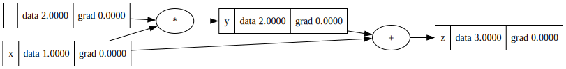

# 🧠 Micrograd

A minimalistic, educational implementation of a scalar-based automatic differentiation engine and a small neural network library built on top of it — all in pure Python.
- The neural network library is an additional ~50 lines.
- Operates on **scalar values only**, meaning each neuron is broken down into primitive operations like tiny adds and multiplies.
- Despite its simplicity, this system can build and train full deep neural networks for classification / regression problems as well.

---

## ✨ Features

- **Autograd Engine**: Supports reverse-mode automatic differentiation.
- **Value Class**: Tracks operations and computes gradients.
- **Neural Network API**: Includes `Neuron`, `Layer`, and `MLP` abstractions.
- **Backpropagation**: Fully functional backward pass with graph traversal.
- **Educational**: Easy to understand and extend for learners.

---

## Example Usage
Below is a slightly contrived example showing a number of possible supported operations:

``` bash
from micrograd.engine import Value

a = Value(-4.0)
b = Value(2.0)
c = a + b
d = a * b + b**3
c += c + 1
c += 1 + c + (-a)
d += d * 2 + (b + a).relu()
d += 3 * d + (b - a).relu()
e = c - d
f = e**2
g = f / 2.0
g += 10.0 / f
ee = a.exp()
tt = a.tanh()
rr = a.relu()
print(f'{g.data:.4f}') # prints 24.7041, the outcome of this forward pass
g.backward()
print(f'{a.grad:.4f}') # prints 138.8338, i.e. the numerical value of dg/da
print(f'{b.grad:.4f}') # prints 645.5773, i.e. the numerical value of dg/db

```


## Training a Neural Net
The notebook demo.ipynb provides a full demo of training an 2-layer neural network (MLP) with 2 hidden layers each of 4 nodes with sample inputs and desired outputs.This is achieved by initializing a neural net from micrograd.neural_net module and implementing a custom TanH activation function.


## Tracing / Visualization

For added convenience, the notebook trace_graph.ipynb produces graphviz visualizations. E.g. this one below is of a example. For more examples look up trace_graph_demo.ipynb file
``` bash
from micrograd.engine import Value
x = Value(1.0, label = 'x')
y = 2 * x; y.label = 'y'
z = x + y; z.label = 'z'

draw_dot(z)
```



